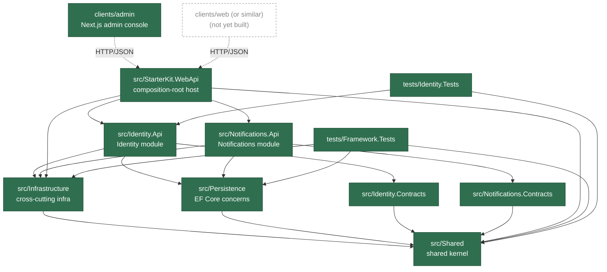

# StarterKit — Modular Monolith Solution Template for ASP.NET Core

A starter template monorepo for a full-stack application: a C#/.NET backend organized as a **Modular Monolith** (built on the private "Light" framework family — `Lightsoft.*` packages), plus one or more frontend clients. Meant to be cloned/forked as the starting point for new projects.

## Status — what's actually built so far

Backend has a working host with two business modules; the `admin` client is a real, functioning app (not a UI shell) with no mock data remaining.

| Piece | Status |
|---|---|
| `src/Shared`, `src/Infrastructure`, `src/Persistence` (shared kernel + EF Core concerns) | ✅ built |
| `src/Identity.Api` + `src/Identity.Contracts` (Identity module — users, roles, claims, JWT auth, permission catalog) | ✅ built, tested (`tests/Identity.Tests`, ~96 tests) |
| `src/Notifications.Api` + `src/Notifications.Contracts` (Notifications module — storage + real-time push over SignalR) | ✅ built — no dedicated test project yet |
| `src/Migrations/{MSSQL,PostgreSQL,Sqlite}` (design-time EF Core migration projects) | ✅ built |
| `src/StarterKit.WebApi` (composition-root host) | ✅ built — runnable API |
| `tests/Framework.Tests` (xUnit v3, shared kernel/infra/persistence) | ✅ built — ~69 tests |
| `clients/admin` (Next.js admin console) | ✅ built — real auth, full Users/Roles CRUD, real-time Notifications; Home page (`/`) shows a session-backed profile summary plus the live notification inbox |
| Additional `clients/*` apps (e.g. a primary `clients/web` end-user app) | ❌ not yet created |

## Structure

Projects that exist today, and how they depend on each other:

```text
StarterKit.slnx
├── src/Shared                    (leaf project — no dependencies)
├── src/Infrastructure            → depends on Shared
├── src/Persistence               → depends on Shared
├── src/Identity.Contracts        → depends on Shared
├── src/Identity.Api              → depends on Identity.Contracts, Infrastructure, Persistence
├── src/Notifications.Contracts   → depends on Shared
├── src/Notifications.Api         → depends on Notifications.Contracts, Infrastructure, Persistence
├── src/Migrations/MSSQL          → depends on Identity.Api, Notifications.Api, Infrastructure, Persistence, Shared
├── src/Migrations/PostgreSQL     → depends on Identity.Api, Infrastructure, Persistence, Shared
├── src/Migrations/Sqlite         → depends on Identity.Api, Infrastructure, Persistence, Shared
├── src/StarterKit.WebApi         → depends on Identity.Api, Notifications.Api, Infrastructure, Shared (composition-root host)
├── tests/Framework.Tests         → depends on Shared, Infrastructure, Persistence
├── tests/Identity.Tests          → depends on Identity.Api, Shared
└── clients/admin                 (Next.js app — HTTP/JSON only, no shared source with src/)
```

## Architecture Diagram

Solid boxes/arrows are built today; dashed ones are still planned or partial.



## Tech Stack

| Layer | Stack |
|---|---|
| Backend runtime | ASP.NET Core (C#), `net10.0` |
| Backend architecture | Modular Monolith — flat projects under `src/`: `Identity` (`Identity.Api` + `Identity.Contracts`) and `Notifications` (`Notifications.Api` + `Notifications.Contracts`), plus shared kernel (`Shared`, `Infrastructure`, `Persistence`) and the `StarterKit.WebApi` composition-root host |
| Backend data access | EF Core — provider-configurable via `DbProvider` in `appsettings.json` (`InMemory` / `PostgreSQL` / `MSSQL` / `Sqlite`), with a dedicated design-time migrations project per relational provider (`src/Migrations/{MSSQL,PostgreSQL,Sqlite}`) |
| Vendor framework | `Lightsoft.*` package family (mediator, `Result`/`Paged` contracts, domain base types, ASP.NET Core authorization/modularity/CORS helpers, Serilog) |
| Testing | xUnit v3 — `tests/Framework.Tests` (shared kernel/infra/persistence, ~69 tests), `tests/Identity.Tests` (Identity module, ~96 tests); no dedicated test project for Notifications yet; no mocking library — hand-written fakes |
| Clients | `clients/admin/` — Next.js 16 (App Router), React 19, TypeScript, Tailwind CSS v4, pnpm. Real auth (encrypted-cookie sessions, proactive token refresh), full Users/Roles CRUD against `Identity.Api`, real-time Notifications via SignalR (browser connects directly to the backend). No mock data remaining. Currently the only client app — no other `clients/*` subfolder exists yet |

## Getting Started

### Backend

```bash
dotnet build StarterKit.slnx
dotnet test tests/Framework.Tests/Framework.Tests.csproj
dotnet test tests/Identity.Tests/Identity.Tests.csproj
dotnet run --project src/StarterKit.WebApi/StarterKit.WebApi.csproj
```

Configure the DB provider and connection string in `src/StarterKit.WebApi/appsettings.json` (`DbProvider`: `InMemory` | `PostgreSQL` | `MSSQL` | `Sqlite`).

### Client (`clients/admin`)

```bash
cd clients/admin
pnpm install
cp .env.example .env.local   # set API_BASE_URL, TOKEN_ENCRYPTION_KEY, NEXT_PUBLIC_SIGNALR_HUB_URL
pnpm dev
```

The backend must be running and reachable at `API_BASE_URL` for auth/data pages to work, and its CORS policy must allow the admin app's origin for the SignalR notification hub (`NEXT_PUBLIC_SIGNALR_HUB_URL`) to connect directly from the browser.

## Documentation

- [.claude/PROJECT.md](.claude/PROJECT.md) / [.claude/ARCHITECTURE.md](.claude/ARCHITECTURE.md) — cross-cutting summary.
- [.claude/PROJECT-BACKEND.md](.claude/PROJECT-BACKEND.md) / [.claude/ARCHITECTURE-BACKEND.md](.claude/ARCHITECTURE-BACKEND.md) — verified backend repository/module inventory, layering, dependency direction, shared kernel notes.
- [.claude/PROJECT-CLIENTS.md](.claude/PROJECT-CLIENTS.md) / [.claude/ARCHITECTURE-CLIENTS.md](.claude/ARCHITECTURE-CLIENTS.md) — verified client app inventory and frontend architecture.
- [.claude/DEVELOPMENT.md](.claude/DEVELOPMENT.md) — verified coding/testing conventions.
- [.claude/docs/generated/backend/](.claude/docs/generated/backend/) — generated backend overview, per-module docs, architecture, coding conventions, dependency graph, and development guide.
- [.claude/docs/generated/clients/admin/](.claude/docs/generated/clients/admin/) — generated `admin` client overview, architecture, coding conventions, dependency graph, and development guide.

## License

MIT — see [LICENSE](LICENSE).
