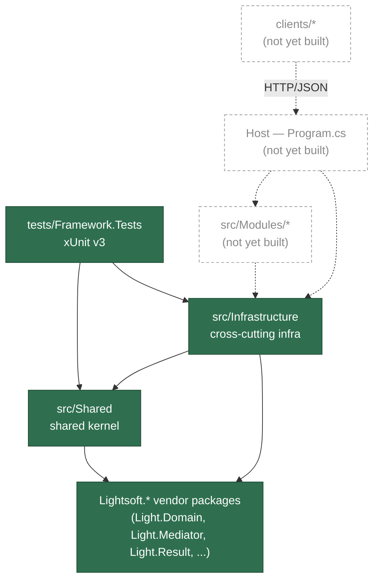

# StarterKit — Modular Monolith Solution Template for ASP.NET Core

A starter template monorepo for a full-stack application: a C#/.NET backend organized as a **Modular Monolith** (built on the private "Light" framework family — `Lightsoft.*` packages), plus one or more frontend clients. Meant to be cloned/forked as the starting point for new projects.

## Status — what's actually built so far

Early scaffold stage: only the backend **shared kernel** and its test project exist right now.

| Piece | Status |
|---|---|
| `src/Shared`, `src/Infrastructure` (shared kernel) | ✅ built |
| `tests/Framework.Tests` (xUnit v3) | ✅ built — 73 tests |
| `src/Modules/*` (business modules) | ❌ not yet scaffolded |
| Composition-root host (WebApi/`Program.cs`) | ❌ not yet created |
| `clients/` (frontend app(s)) | ❌ not yet created |

## Structure

Projects that exist today, and how they depend on each other:

```text
StarterKit.slnx
├── src/Shared            (leaf project — no dependencies)
├── src/Infrastructure    → depends on Shared
└── tests/Framework.Tests → depends on Shared, Infrastructure
```

## Architecture Diagram

Solid boxes/arrows are built today; dashed ones are the intended shape once modules/a host/clients are added.



## Tech Stack

| Layer | Stack |
|---|---|
| Backend runtime | ASP.NET Core (C#), `net10.0` |
| Backend architecture | Modular Monolith — `src/Modules/<ModuleName>/{Domain,Application,Infrastructure,Api}` (not yet scaffolded) |
| Backend data access | EF Core — provider-configurable (InMemory / PostgreSQL / SQL Server / Sqlite) |
| Vendor framework | `Lightsoft.*` package family (mediator, `Result`/`Paged` contracts, domain base types, ASP.NET Core authorization/modularity/CORS helpers, Serilog) |
| Testing | xUnit v3 (`tests/Framework.Tests`), no mocking library — hand-written fakes |
| Clients | not yet added — intended: `clients/<app-name>/`, primary app Next.js (App Router) + TypeScript/React |

## Getting Started

```bash
dotnet build StarterKit.slnx
dotnet test tests/Framework.Tests/Framework.Tests.csproj
```

There is no runnable API/host yet — see Status above.

## Documentation

- [.claude/PROJECT.md](.claude/PROJECT.md) — verified repository/module inventory.
- [.claude/ARCHITECTURE.md](.claude/ARCHITECTURE.md) — verified layering, dependency direction, shared kernel notes.
- [.claude/DEVELOPMENT.md](.claude/DEVELOPMENT.md) — verified coding/testing conventions.
- [.claude/docs/generated/backend/](.claude/docs/generated/backend/) — generated backend overview, architecture, coding conventions, dependency graph, and development guide.

## License

MIT — see [LICENSE](LICENSE).
